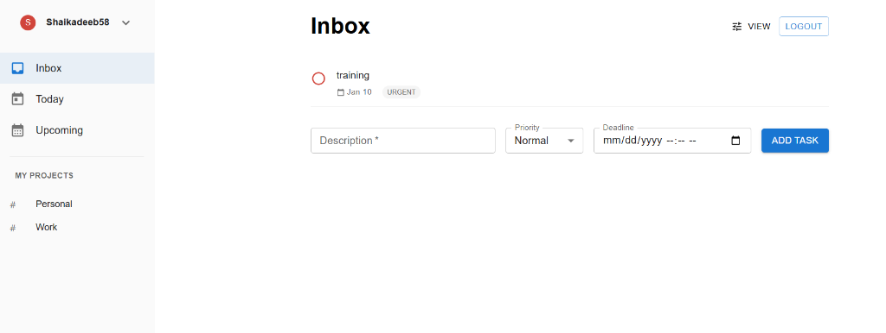
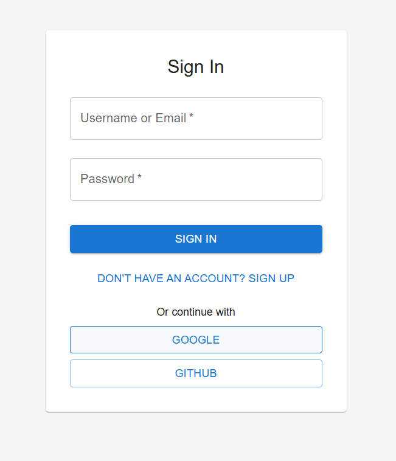

# To-Do List Application

A modern, full-stack To-Do List application built with Spring Boot (Backend) and React/Vite (Frontend). Features a simple UI, OAuth2 authentication, and robust task management.



## Features

*   **Authentication**: Secure login/signup with JWT and OAuth2 (Google & GitHub).
*   **Task Management**: Create, Read, Update, Delete tasks.
*   **Categories**: Inbox, Today, Upcoming views.
*   **Filtering**: Sort by priority, status, or date.
*   **Modern UI**: Responsive design with Material UI, transitions, and "simple" aesthetics.
*   **Database**: Persistent MySQL storage with Flyway migrations.

## Tech Stack

*   **Backend**: Java 17+, Spring Boot 3, Spring Security, Hibernate/JPA, MySQL.
*   **Frontend**: React 18, TypeScript, Vite, Material UI (MUI), Axios.
*   **Tools**: Maven, Docker (optional), MySQL Workbench.

## Prerequisites

*   Java 17 or higher
*   Node.js 18+ and npm
*   MySQL Server 8.0+

## Setup Instructions

### 1. Database Setup
Create the database in MySQL:
```sql
CREATE DATABASE todo_db;
```

### 2. Backend Configuration
1.  Navigate to `backend/`.
2.  Create a `.env` file (based on `.env.example` if available) with your credentials:
    ```properties
    DB_USERNAME=root
    DB_PASSWORD=your_mysql_password
    JWT_SECRET=your_super_secret_key_minimum_32_bytes
    GOOGLE_CLIENT_ID=your_google_client_id
    GOOGLE_CLIENT_SECRET=your_google_client_secret
    GITHUB_CLIENT_ID=your_github_client_id
    GITHUB_CLIENT_SECRET=your_github_client_secret
    ```
3.  Run the application:
    ```bash
    mvn spring-boot:run
    ```

### 3. Frontend Configuration
1.  Navigate to `frontend/`.
2.  Create a `.env` file:
    ```properties
    VITE_GOOGLE_CLIENT_ID=your_google_client_id
    VITE_GITHUB_CLIENT_ID=your_github_client_id
    ```
3.  Install dependencies:
    ```bash
    npm install
    ```
4.  Run the development server:
    ```bash
    npm run dev
    ```

## Usage

1.  Open `http://localhost:5173`.
2.  Log in using email/password or OAuth.
3.  Start managing your tasks!

## Screenshots

### Login Page


### Task Dashboard


## Demo Video

[Watch the working website demo](https://drive.google.com/file/d/1zqw6Hi_PCVhKlyVgVHBPdKk8NXBE2ZIx/view?usp=drive_link)
