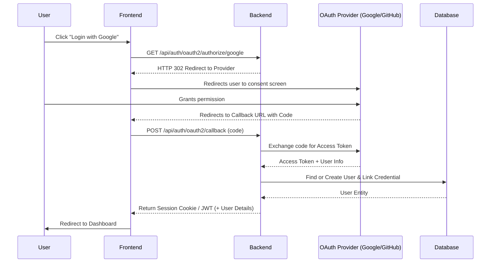
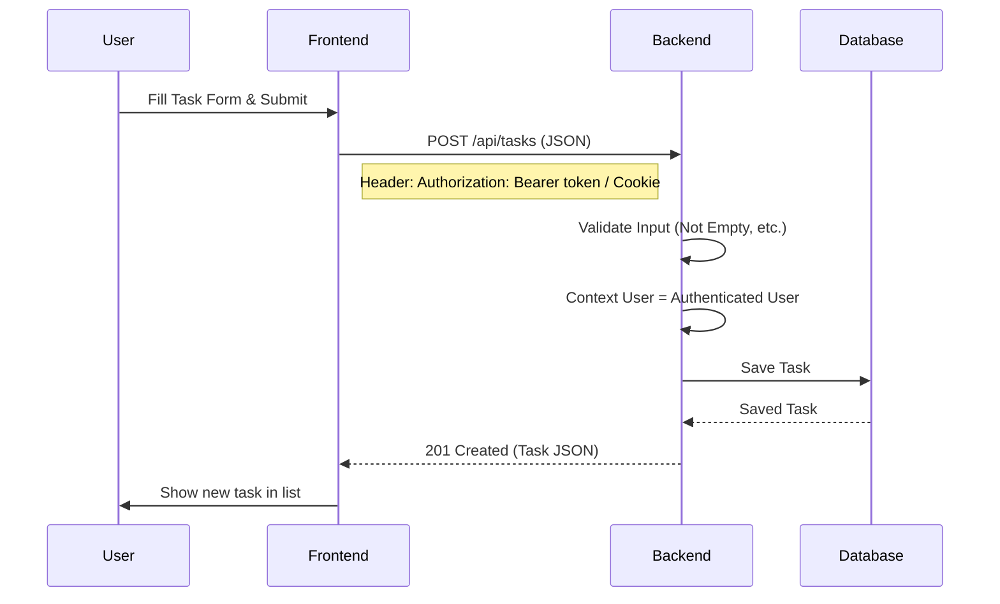
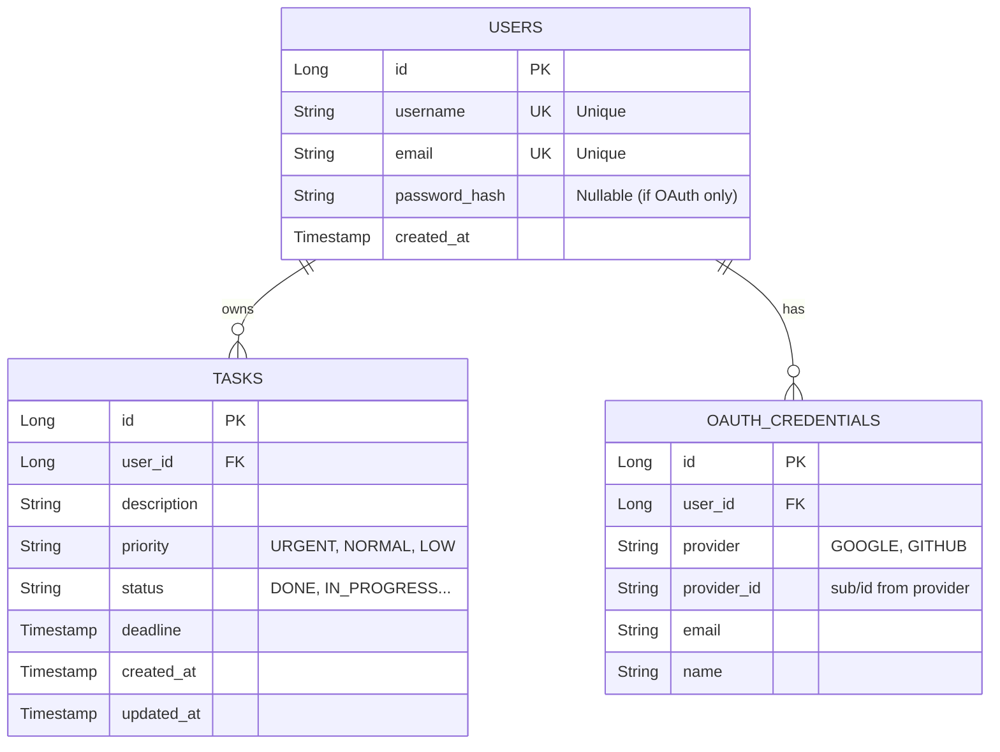

# To-Do Application Specification

## 1. System Overview

### 1.1 Architecture
The application follows a standard layered architecture:
- **Frontend**: Single Page Application (SPA) built with React or Vue. It communicates with the backend via RESTful APIs.
- **Backend**: Spring Boot 3+ application serving REST APIs. It handles business logic, security (OAuth2 + JWT/Sessions), and data persistence.
- **Database**: PostgreSQL relational database.
- **Authentication**: Hybrid approach supporting:
    - **Local Auth**: Username/Password with BCrypt.
    - **OAuth2**: Google and GitHub providers.

#### High-Level Diagram
```mermaid
graph TD
    User((User))
    Browser[Frontend SPA\n(React/Vue)]
    Backend[Spring Boot Backend]
    DB[(PostgreSQL)]
    Google[Google OAuth]
    GitHub[GitHub OAuth]

    User --> Browser
    Browser -- "HTTPS / JSON" --> Backend
    Backend -- "JDBC" --> DB
    Browser -- "Redirects" --> Google
    Browser -- "Redirects" --> GitHub
    Google -- "Callback" --> Backend
    GitHub -- "Callback" --> Backend
```

### 1.2 Sequence Flows

#### OAuth Login Flow


#### Create Task Flow


## 2. Data Model

### 2.1 Entity Relationship Diagram


### 2.2 JPA Entities (Java)

#### User.java
```java
@Entity
@Table(name = "users")
public class User {
    @Id
    @GeneratedValue(strategy = GenerationType.IDENTITY)
    private Long id;

    @Column(nullable = false, unique = true)
    private String username;

    @Column(nullable = false, unique = true)
    private String email;

    @Column(name = "password_hash")
    private String passwordHash; // Nullable for pure OAuth users

    @OneToMany(mappedBy = "user", cascade = CascadeType.ALL, orphanRemoval = true)
    private List<OAuthCredential> credentials = new ArrayList<>();
    
    // Getters, Setters, Constructors
}
```

#### OAuthCredential.java
```java
@Entity
@Table(name = "oauth_credentials", 
       uniqueConstraints = @UniqueConstraint(columnNames = {"provider", "provider_id"}))
public class OAuthCredential {
    @Id
    @GeneratedValue(strategy = GenerationType.IDENTITY)
    private Long id;

    @ManyToOne(fetch = FetchType.LAZY)
    @JoinColumn(name = "user_id", nullable = false)
    private User user;

    @Column(nullable = false)
    private String provider; // e.g., "google", "github"

    @Column(nullable = false, name = "provider_id")
    private String providerId;

    private String email;
    private String name;
}
```

#### Task.java
```java
@Entity
@Table(name = "tasks")
public class Task {
    @Id
    @GeneratedValue(strategy = GenerationType.IDENTITY)
    private Long id;

    @ManyToOne(fetch = FetchType.LAZY)
    @JoinColumn(name = "user_id", nullable = false)
    private User owner;

    @Column(nullable = false)
    private String description;

    @Enumerated(EnumType.STRING)
    @Column(nullable = false)
    private Priority priority; // URGENT, NORMAL, DO_WHEN_TIME_ALLOWS

    @Enumerated(EnumType.STRING)
    @Column(nullable = false)
    private Status status; // DONE, IN_PROGRESS, NOT_STARTED, MISSED_DEADLINE

    private LocalDateTime deadline;

    @CreationTimestamp
    private LocalDateTime createdAt;
    
    @UpdateTimestamp
    private LocalDateTime updatedAt;
}
```

### 2.3 Flyway Migration Script (`V1__init_schema.sql`)

```sql
CREATE TABLE users (
    id BIGSERIAL PRIMARY KEY,
    username VARCHAR(255) NOT NULL UNIQUE,
    email VARCHAR(255) NOT NULL UNIQUE,
    password_hash VARCHAR(255),
    created_at TIMESTAMP DEFAULT CURRENT_TIMESTAMP
);

CREATE TABLE oauth_credentials (
    id BIGSERIAL PRIMARY KEY,
    user_id BIGINT NOT NULL REFERENCES users(id) ON DELETE CASCADE,
    provider VARCHAR(50) NOT NULL,
    provider_id VARCHAR(255) NOT NULL,
    email VARCHAR(255),
    name VARCHAR(255),
    UNIQUE(provider, provider_id)
);

CREATE TABLE tasks (
    id BIGSERIAL PRIMARY KEY,
    user_id BIGINT NOT NULL REFERENCES users(id) ON DELETE CASCADE,
    description TEXT NOT NULL,
    priority VARCHAR(50) NOT NULL,
    status VARCHAR(50) NOT NULL,
    deadline TIMESTAMP,
    created_at TIMESTAMP DEFAULT CURRENT_TIMESTAMP,
    updated_at TIMESTAMP DEFAULT CURRENT_TIMESTAMP
);

CREATE INDEX idx_tasks_user ON tasks(user_id);
CREATE INDEX idx_tasks_deadline ON tasks(deadline);
```

## 3. REST API Specification

### Error Handling Protocol
All errors return the following structure (HTTP 4xx/5xx):
```json
{
  "code": "INVALID_INPUT",
  "message": "Description cannot be empty",
  "details": ["Field 'description' must not be blank"],
  "timestamp": "2023-10-27T10:00:00Z"
}
```

### 3.1 Authentication

#### POST /api/auth/signup
- **Body**: `{ "username": "user", "email": "a@b.com", "password": "secure123" }`
- **Success**: 201 Created `{ "id": 1, "username": "...", "email": "..." }`
- **Errors**: 409 Conflict (Duplicate details), 400 Bad Request (Validation).

#### POST /api/auth/login (Local)
- **Body**: `{ "identifier": "user_or_email", "password": "..." }`
- **Success**: 200 OK `{ "token": "jwt_token_here", "user": { ... } }`
- **Errors**: 401 Unauthorized.

#### GET /api/auth/oauth2/authorize/{provider}
- **Providers**: `google`, `github`
- **Action**: Redirects browser to OAuth provider login page.

#### POST /api/auth/oauth2/callback
- **Body**: `{ "code": "auth_code_from_provider", "provider": "google" }`
- **Success**: 200 OK `{ "token": "jwt_token_here", "user": { ... } }`
- **Note**: Exchanges code for access token, fetches user profile, creates/logs in user.

### 3.2 Tasks

#### GET /api/tasks
- **QueryParams**: 
    - `sort`: `priority` (asc), `-deadline` (desc), etc.
    - `filterPriority`: `URGENT`
    - `filterStatus`: `IN_PROGRESS`
    - `deadlineFrom`: ISO_DATE
    - `deadlineTo`: ISO_DATE
    - `page`, `size`: Pagination
- **Success**: 200 OK `{ "content": [ { "id": 1, ... } ], "totalPages": 5, ... }` (PageImpl)

#### POST /api/tasks
- **Body**: `{ "description": "Buy milk", "priority": "NORMAL", "deadline": "2023-10-30T12:00:00" }`
- **Description**: Creates a task. Status defaults to `NOT_STARTED`.
- **Success**: 201 Created `{ "id": 1, ... }`

#### GET /api/tasks/{id}
- **Success**: 200 OK
- **Errors**: 404 Not Found (if not exists or not owned by user).

#### PUT /api/tasks/{id}
- **Body**: `{ "description": "...", "status": "DONE", ... }`
- **Description**: Updates fields. Can trigger status changes (e.g. to MISSED_DEADLINE if checked).
- **Success**: 200 OK

#### DELETE /api/tasks/{id}
- **Success**: 204 No Content

## 4. Security Design

### Framework
- **Spring Security 6+**: Logic for securing endpoints.
- **JWT (JSON Web Token)**: Stateless authentication.
    - Token contains `sub` (username/id), `roles` (["ROLE_USER"]), `exp` (expiration).
    - Signed with HMAC-SHA256 (HS256).
- **Passwords**: `BCryptPasswordEncoder` (strength 10+).

### Configuration Strategy
- **SecurityFilterChain**:
    - `csrf().disable()` (stateless API).
    - `cors()`: Enabled for frontend origin.
    - `sessionManagement().sessionCreationPolicy(STATELESS)`.
    - `authorizeHttpRequests`:
        - `/api/auth/**`: Permit All.
        - `/api/tasks/**`: Authenticated.
- **OAuth2**: 
    - Use Spring Security OAuth2 Client for the code exchange logic or implement manually via REST template if preferring full manual control (Recommended for SPA flow: Frontend handles redirect, Backend swaps code).
    - **Recommended SPA Workflow**: Frontend receives 'code', sends to Backend. Backend talks to Provider. This avoids exposing Client Secret to Frontend.

## 5. Backend Implementation Guide

### 5.1 Project Structure
```text
com.example.todo
├── config       # SecurityConfig, WebConfig
├── controller   # AuthController, TaskController, GlobalExceptionHandler
├── dto          # AuthRequest, TaskRequest, ErrorResponse
├── entity       # User, Task, OAuthCredential
├── exception    # AppException, ResourceNotFoundException
├── repository   # UserRepository, TaskRepository
└── service      # UserService, TaskService, AuthService
```

### 5.2 Key Code Snippets

#### Global Exception Handler
```java
@RestControllerAdvice
public class GlobalExceptionHandler {

    @ExceptionHandler(AppException.class)
    public ResponseEntity<ErrorResponse> handleAppException(AppException ex) {
        return ResponseEntity.status(ex.getStatus())
            .body(new ErrorResponse(ex.getCode(), ex.getMessage(), null, LocalDateTime.now()));
    }

    @ExceptionHandler(MethodArgumentNotValidException.class)
    public ResponseEntity<ErrorResponse> handleValidation(MethodArgumentNotValidException ex) {
        List<String> details = ex.getBindingResult().getFieldErrors().stream()
            .map(err -> err.getField() + ": " + err.getDefaultMessage())
            .collect(Collectors.toList());
        return ResponseEntity.badRequest()
            .body(new ErrorResponse("VALIDATION_ERROR", "Validation failed", details, LocalDateTime.now()));
    }
}
```

#### Security Configuration (Abstract)
```java
@Bean
public SecurityFilterChain filterChain(HttpSecurity http, JwtTokenFilter jwtFilter) throws Exception {
    http
        .csrf(AbstractHttpConfigurer::disable)
        .cors(Customizer.withDefaults())
        .sessionManagement(s -> s.sessionCreationPolicy(SessionCreationPolicy.STATELESS))
        .authorizeHttpRequests(auth -> auth
            .requestMatchers("/api/auth/**").permitAll()
            .anyRequest().authenticated()
        )
        .addFilterBefore(jwtFilter, UsernamePasswordAuthenticationFilter.class);
    return http.build();
}
```

#### Task Repository (Sorting & Filtering)
```java
public interface TaskRepository extends JpaRepository<Task, Long>, JpaSpecificationExecutor<Task> {
    // Basic finding
    Page<Task> findByOwnerId(Long userId, Pageable pageable);
    
    // For more complex filtering, use Specifications or @Query
    @Query("SELECT t FROM Task t WHERE t.owner.id = :userId " +
           "AND (:priority IS NULL OR t.priority = :priority) " +
           "AND (:status IS NULL OR t.status = :status)")
    Page<Task> findFiltered(@Param("userId") Long userId, 
                            @Param("priority") Priority priority, 
                            @Param("status") Status status, 
                            Pageable pageable);
}
```

#### Task Service (Create & Update Logic)
```java
@Service
@Transactional
public class TaskService {
    @Autowired private TaskRepository taskRepo;
    
    public Task createTask(User user, TaskRequest req) {
        Task task = new Task();
        task.setOwner(user);
        task.setDescription(req.getDescription());
        task.setPriority(req.getPriority() != null ? req.getPriority() : Priority.NORMAL);
        task.setStatus(Status.NOT_STARTED);
        task.setDeadline(req.getDeadline());
        return taskRepo.save(task);
    }
    
    public Task updateTask(Long taskId, Long userId, TaskRequest req) {
        Task task = taskRepo.findById(taskId)
            .filter(t -> t.getOwner().getId().equals(userId))
            .orElseThrow(() -> new ResourceNotFoundException("Task not found"));
            
        if (req.getDescription() != null) task.setDescription(req.getDescription());
        if (req.getStatus() != null) task.setStatus(req.getStatus());
        // Handle deadline logic...
        
        return taskRepo.save(task);
    }
}
```

## 6. Frontend Implementation Guide

### 6.1 Structure & Stack
- **Stack**: React + TypeScript + MUI (Material UI).
- **Directories**: `src/components`, `src/pages`, `src/services`, `src/context`.

### 6.2 Service Layer (Axios)
```typescript
// src/services/api.ts
import axios from 'axios';

const api = axios.create({
    baseURL: '/api'
});

api.interceptors.request.use(config => {
    const token = localStorage.getItem('token');
    if (token) {
        config.headers.Authorization = `Bearer ${token}`; // Fix: Removed extra quote
    }
    return config;
});

api.interceptors.response.use(
    response => response,
    error => {
        if (error.response?.status === 401) {
            // clear token, redirect to login
            localStorage.removeItem('token');
            window.location.href = '/login';
        }
        return Promise.reject(error);
    }
);

export const getTasks = (params: any) => api.get('/tasks', { params });
export const createTask = (data: any) => api.post('/tasks', data);
```

### 6.3 Components

#### TaskList.tsx
```tsx
import { useEffect, useState } from 'react';
import { getTasks } from '../services/api';
import { Grid, Card, Typography, Chip } from '@mui/material';

export const TaskList = () => {
    const [tasks, setTasks] = useState([]);
    
    useEffect(() => {
        loadTasks();
    }, []);

    const loadTasks = async () => {
        try {
            const res = await getTasks({ sort: 'priority' });
            setTasks(res.data.content);
        } catch (err) {
            console.error(err);
        }
    };

    return (
        <Grid container spacing={2}>
            {tasks.map((task: any) => (
                <Grid item xs={12} md={4} key={task.id}>
                    <Card variant="outlined" sx={{ p: 2 }}>
                        <Typography variant="h6">{task.description}</Typography>
                        <Chip label={task.priority} color={task.priority === 'URGENT' ? 'error' : 'default'} />
                        <Chip label={task.status} />
                    </Card>
                </Grid>
            ))}
        </Grid>
    );
};
```
